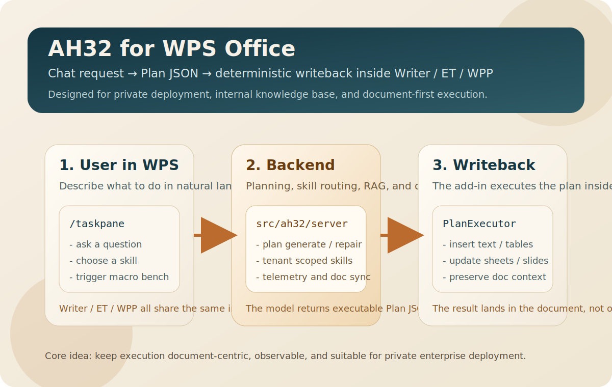
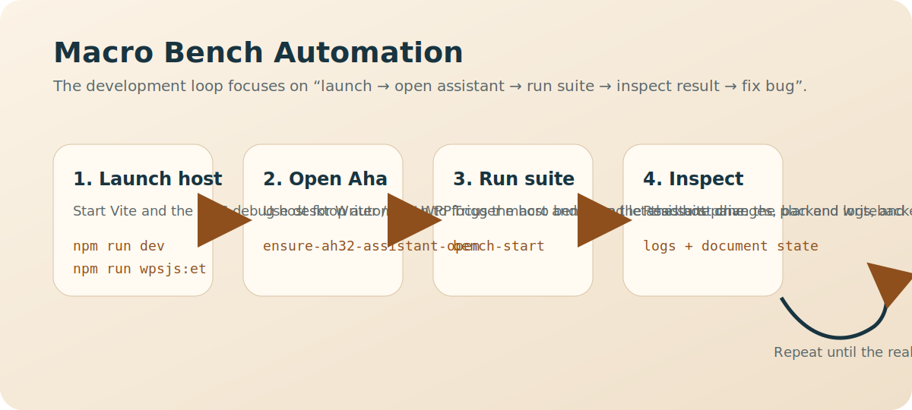
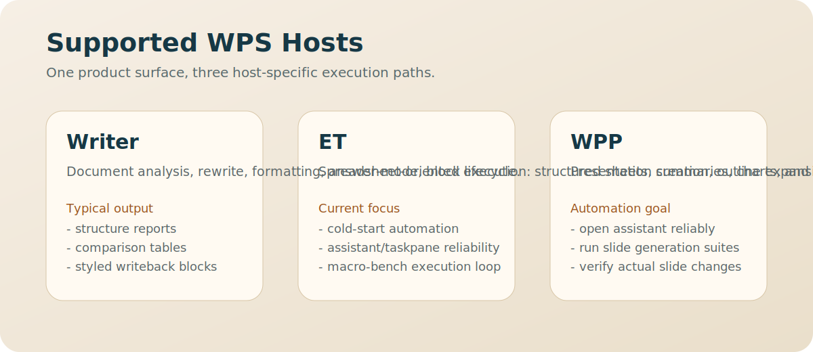

# AH32 (Aha)

[English](README.en.md) | [中文](README.md)

AH32 (product name: **Aha**) is an enterprise office assistant for **WPS Office**, designed for “private deployment + internal knowledge base + writeback to documents”. In chat, the model outputs an executable **Plan JSON** and the WPS add-in applies it to your document (text/tables/formatting/images) deterministically.

Note: due to historical reasons, the backend Python package directory remains `src/ah32/` (import path is still `ah32`).

## Latest Milestone

- Current milestone version: `v0.3.0`
- This is the first unattended macro-bench automation milestone across Writer, ET, and WPP.
- Current validated baseline: chat macro-bench `14/14` green.
- Milestone details: [CHANGELOG.md](CHANGELOG.md)

## Visual Overview

### Product Overview



### Macro Bench Automation Flow



### Host Support



## What it’s for (use cases)

- **Bidding / tender docs**: extract requirements, deviations, clarification questions, risks, and write them back into the working document.
- **Policies / compliance / contracts**: check key clauses and missing items, produce actionable review notes and checklists.
- **Meeting minutes & reports**: turn messy notes into outlines/action items and write back in a consistent format.
- **Spreadsheets (ET)**: summarize and structure data; optionally generate tables/charts via writeback.
- **Enterprise knowledge base (RAG)**: ingest contracts/cases/templates/policies; retrieve relevant snippets during chat; clearly indicates when the library needs more data.

## Enterprise / private deployment (recommended)

Typical shape: **WPS add-in (client) + AH32 backend (your intranet/cloud) + tenant-scoped storage (per org)**.

- **Data isolation**: on-disk storage is split by `storage/tenants/<tenant_id>/...` to avoid cross-tenant mixing.
- **Document context**: in remote-backend mode, the client uploads a “doc snapshot” and chat requests only reference `doc_snapshot_id` (keeps requests small and stable).
- **Governance**: auth is off by default; enterprises can enable API Key/JWT; outbound web access supports a blacklist policy + audit logs (fits intranet/bank environments).

## Quick start (private / intranet)

Backend (server/intranet machine):

```bash
docker compose up -d --build
```

Default address: `http://127.0.0.1:5123`

Client (install WPS add-in): see “Install the WPS Plugin (connect to a remote backend)” below.

## Download & Install

We recommend distributing via GitHub Releases (plugin zip + backend package). Packaging details: `PACKAGING.md`.

## Contact

- Prefer GitHub Issues (please include screenshots/logs/repro steps if possible).
- For quick contact / collaboration: WeChat `abaokaimen` (note: AH32/GitHub).

### Install the WPS Plugin (connect to a remote backend)

1) Download `Ah32WpsPlugin.zip` and unzip it
2) Run the install script (set `ApiBase` to your backend URL):

```powershell
powershell -ExecutionPolicy Bypass -File .\install-wps-plugin.ps1 `
  -PluginSource .\wps-plugin `
  -ApiBase http://<YOUR_BACKEND_HOST>:5123 `
  -ApiKey <YOUR_KEY>
```

3) Restart WPS

Security & privacy: `SECURITY.md`.

## Repository Layout

Only the core directories are listed here.

- `src/ah32/`: backend (FastAPI; import path `ah32`)
  - `server/`: HTTP API (entry: `python -m ah32.server.main`)
  - `agents/`: chat/execution agent logic (planning, tool-use, writeback pipeline)
  - `skills/`: SkillRegistry/SkillRouter (hot-loaded from runtime `skills/`)
  - `services/`: prompts, @ references, memory/RAG, etc.
  - `telemetry/`: observability and events
  - `dev/`: dev/bench/debug (OFF by default; `/dev/*` only when `AH32_ENABLE_DEV_ROUTES=true`)
- `ah32-ui-next/`: frontend (Vue 3 + TypeScript + Vite) + WPS add-in
  - `src/`: frontend code
  - `src/dev/`, `src/components/dev/`: MacroBench & debug panels (`VITE_ENABLE_DEV_UI=true`)
  - `manifest.xml` / `ribbon.xml` / `taskpane.html`: add-in entry/config
  - `wps-plugin/`: build output (runtime load dir; usually not committed)
  - `install-wps-plugin.ps1` / `uninstall-wps-plugin.ps1`: Windows install/uninstall scripts
- `skills/`: runtime skills directory (hot-loaded by default)
- `schemas/`: JSON schemas (e.g., `ah32.skill.v1`, `ah32.styleSpec.v1`)
- `scripts/`: dev/packaging scripts
- `installer/`: installer assets and scripts (multi-platform)

Do NOT commit runtime/generated folders (may be large or contain secrets): `storage/`, `logs/`, `.venv/`, `ah32-ui-next/node_modules/`, `ah32-ui-next/wps-plugin/`, `dist/`, `build/`, `_release/`, `.env`.

## Dev Quick Start

Backend:

```bash
python -m venv .venv
# Windows:
.venv\\Scripts\\activate
# macOS/Linux:
# source .venv/bin/activate

pip install -e ".[dev]"
cp .env.example .env   # Windows: copy .env.example .env

python -m ah32.server.main
```

Frontend (WPS TaskPane):

```bash
cd ah32-ui-next
npm install
npm run dev
```

Default backend address: `http://127.0.0.1:5123`

## Packaging / Release

See `PACKAGING.md`.

